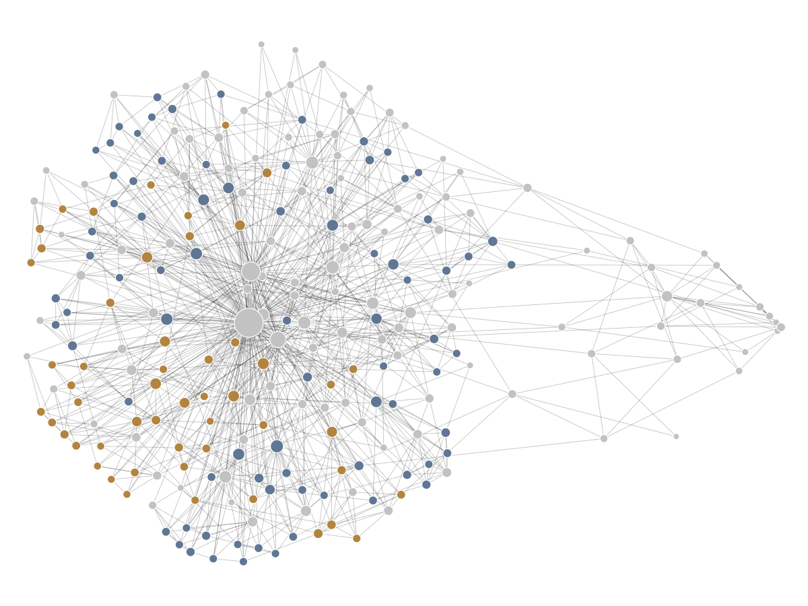

# Fundamentals Kasten

A blank Zettelkasten for software engineering fundamentals — 130 atomic concepts across a Systems
ladder and an AI ladder, 19 build-to-learn exercises, 38 tier-ranked sources and a 28-week
program, wired together with 1,522 links.

<p align="center">
  <picture>
    <source media="(prefers-color-scheme: dark)" srcset="docs/graph-dark.svg">
    
  </picture>
</p>

<p align="center">
  <sub>
    252 notes · 1,125 links · not one word of explanation in any of them.<br>
    A map of how the notes connect, not an embedding space.<br>
    Blue is the Systems ladder, amber the AI ladder, grey the scaffolding that holds them
    together. Drawn from the actual wikilinks by
    <a href="scripts/graph.py"><code>scripts/graph.py</code></a>.
  </sub>
</p>

**Every note is empty.** That is the design, not an oversight. The picture above is the whole
proposition in one image: the structure ships, and the content is your side of the deal.

Nothing here is chunked, embedded, or waiting to be retrieved by a model. `02-ai/` teaches how
retrieval works; it doesn't use it. The only retrieval this is built for is yours, months
later, without the file open.

---

## Read this before you file an issue asking where the content is

This repository ships scaffolding: what each concept is called, which rung it sits on, which
question it answers, which source to open, and what it connects to. It deliberately does not
ship explanations.

A kasten filled with correct-sounding paragraphs you did not write is worse than no kasten at
all, because it produces recognition and recognition feels exactly like knowledge until the
moment you need to use it. Every concept note here has a section called **In my own words**.
That section is the only part of this repository that will ever have any value, and only you
can write it.

So: the value you get out is proportional to what you put in. If that isn't the trade you
want, you want a textbook, and there are excellent ones listed in `05-sources/`.

## The problem this is for

You can ship features. You can prompt a model into a working implementation. And you have a
quiet suspicion that you are getting further from the machine every year rather than closer —
that you would struggle to explain why the code you just merged is fast, or how it will fail.

That suspicion is usually correct, and it is not fixed by learning another framework.

## The thesis: invest by half-life

| Knowledge type | Half-life | Example |
|---|---|---|
| Framework / library API | ~3 years | The current React data-fetching pattern |
| Language | ~10 years | Go, C#, Python |
| Systems concept | ~40 years | Cache locality, ACID, TCP, coupling |
| Reasoning skill | Career-length | Decomposition, failure analysis, tradeoff judgment |

Most developer anxiety comes from spending 90% of learning time on the top row — which is
exactly the row a language model does well, because it is fully documented, highly patterned
and low-judgment. The bottom two rows compound, and they are the rows where a model needs a
supervisor who can tell whether its answer is right.

Use the table as a filter before you spend an evening on anything. That filter is written up
as [The noise filter](00-meta/The%20noise%20filter.md).

## The method: permanent notes, not collected ones

The structure follows Sönke Ahrens' *How to Take Smart Notes*, adapted for technical material:

- **Fleeting notes** — whatever you scribble while reading. Not in this repo; they belong in
  your own inbox and they are meant to be thrown away.
- **Literature notes** — one per source, in `05-sources/`. What the source claimed, in your
  words, with a page or chapter you can point at.
- **Permanent notes** — one idea per note, reformulated from scratch, explicitly linked to the
  notes it bears on. That is the 130 concept notes, and writing them is the whole exercise.

The full argument, and where this deviates from Ahrens on purpose, is in
[00-meta/Methodology.md](00-meta/Methodology.md).

One deviation is worth stating up front, because it is the load-bearing one. Ahrens' test for
a permanent note is whether it makes sense to a stranger months later. The test here is
harder and more specific:

> **You understand a system when you can predict how it breaks.**

Every concept note opens with a *Predict the failure* line. Not "can I define this" — "what
goes wrong in production when this is absent, wrong, or misunderstood." A definition you can
recite is worth very little. A failure you can anticipate is worth a great deal.

## What's in here

```
00-meta/            methodology, the note contract, 15 operating principles, status board
01-systems/         S01–S10 — the machine, concurrency, networking, data, distributed,
                    design, security, operations, toolchain, debugging      (70 concepts)
02-ai/              A1–A9 — model internals, inference, prompting, grounding, agents,
                    evaluation, production, limits, economics               (43 concepts)
03-methodologies/   Waterfall through XP, TDD, CI, and AI-assisted development (13)
04-senior-multipliers/  ADRs, estimation, saying no with a reason, writing        (4)
05-sources/         38 sources, tier-ranked, free ones marked
06-builds/          19 build-to-learn exercises — the part that isn't reading
07-program/         a 28-week sequence in two-week blocks
08-decisions/       ADR-0001 is blank, and writing it is your first task
capstone/           the exam
_templates/         note templates
docs/               the graph above
scripts/            reset.py — restore every note to stub
                    graph.py — redraw the graph from your own links
```

Start at [MOC.md](MOC.md) — the map of contents — or at
[00-meta/How to use this kasten.md](00-meta/How%20to%20use%20this%20kasten.md) if you would
rather be told what to do on day one.

## The status ladder

Four states, in frontmatter, on every concept note:

| | `status` | Means |
|---|---|---|
| 🌱 | `stub` | Generated scaffolding. You haven't touched it. |
| 🌿 | `drafted` | You read a source and filled in the body. |
| 🌳 | `explained` | You wrote *In my own words* with the book closed. |
| 🔥 | `tested` | You predicted a failure mode and then caused it, or built something that depends on it. |

Everything in this repo ships at 🌱. `explained` is the minimum for calling something known;
`tested` is the real bar, and it is the one most learning systems quietly omit.

Do not aim for a full repo of 🌳. That is collecting, and collecting is the trap this is
built to avoid. Aim for every concept in your current block at 🌳 and that block's build at 🔥.

## Watching it fill in

The graph at the top is generated rather than screenshotted, so it is worth rerunning as you
work:

```bash
python scripts/graph.py
```

That redraws `docs/graph-light.svg` and `docs/graph-dark.svg` from whatever your notes
currently link to. `python scripts/graph.py --stats` prints the same numbers without drawing
anything. Standard library only, no install step, and the layout is seeded, so the same vault
always produces the same picture and a diff means the links really changed.

Two readings are worth having:

- **Orphans.** A note nothing links to is a note you filed and never used. `--stats` counts
  them. A rising orphan count is the earliest sign that you have gone back to collecting.
- **Where the hubs are.** In a fresh copy the biggest nodes are the generated indexes, because
  indexes are all there is. In a kasten you have actually worked in, concepts start to outrank
  them — that is what a retrieval map looks like once it is yours rather than the generator's.

## Obsidian is recommended, not required

The notes are plain markdown with YAML frontmatter and `[[wikilinks]]`. Nothing here needs a
plugin — the Dataview queries in the status board are commented out, and the repo works with
them switched off forever.

**In Obsidian** (free, and the recommended way): open the repo folder as a vault. Wikilinks
resolve, backlinks and graph view work, and the structure is browsable the way it was designed.
Turn on *Settings → Files & Links → Automatically update internal links* before you rename
anything.

**On GitHub or in any other editor:** the notes are readable, but `[[wikilinks]]` render as
literal text rather than links, and `> [!question]` callouts render as plain blockquotes. This
is a deliberate trade — 1,522 wikilinks are worth more inside the tool you will actually study
in than they are in a browser tab. `README.md` and `MOC.md` use ordinary relative links so
navigation works from the web.

**Anything else that reads markdown** — Logseq, Foam, VS Code, `grep` — works fine.

## How to fork it

Click **Use this template** on GitHub. That gives you your own repo with no shared history,
which is what you want: your kasten is yours, and it should diverge from this one immediately.

Then:

1. Open the folder as an Obsidian vault.
2. Read [00-meta/How to use this kasten.md](00-meta/How%20to%20use%20this%20kasten.md) and
   [00-meta/Note contract.md](00-meta/Note%20contract.md). Ten minutes, and they explain the
   rules every note follows.
3. Write `08-decisions/ADR-0001` — choosing your primary language. It is blank, it is one
   page, and doing it first stops you from spending week three comparing languages instead of
   learning one.
4. Open `07-program/Block 01-02 — The machine.md` and start.
5. Run `python scripts/graph.py` whenever you want to see what you have actually built.

If you drift from the structure, that is a good sign rather than a bad one. `scripts/reset.py`
exists if you want to hand a clean copy to someone else.

## Provenance and license

The concept inventory, the two ladders, the question lists, the half-life table, the build
briefs and the 28-week sequence come from *The Fundamentals Reset (Field Manual, Edition
2026)*, which I wrote with AI assistance. The scaffolding in this repo was generated from it
and then edited by hand.

Notes and prose: [CC BY-SA 4.0](LICENSE). Scripts: MIT. Attribution appreciated, a link back
is plenty, and if you fill this in properly I would genuinely like to see what you did with it.
